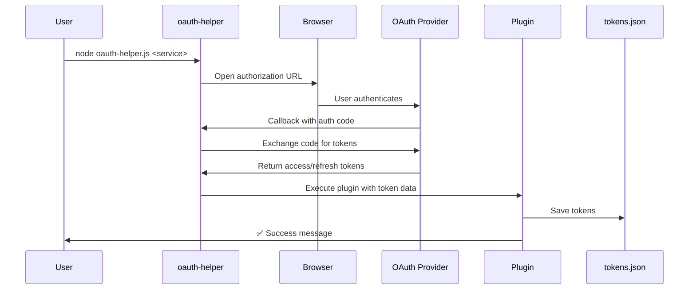
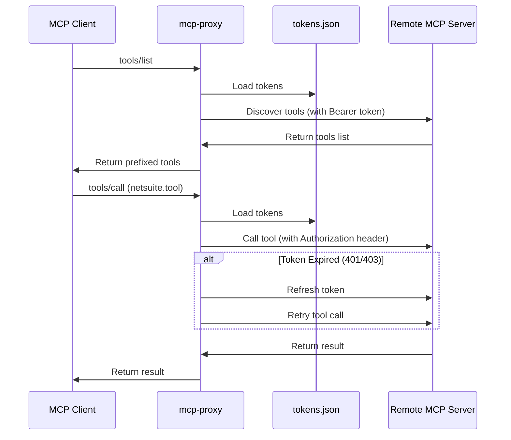
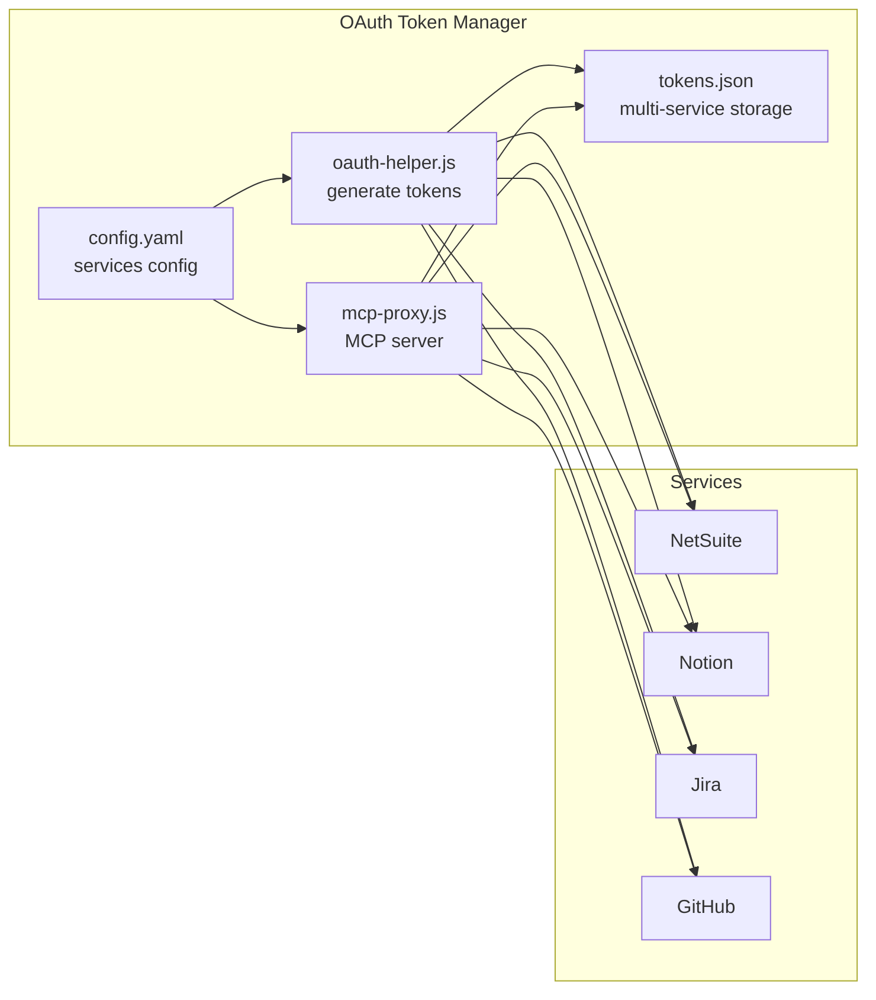
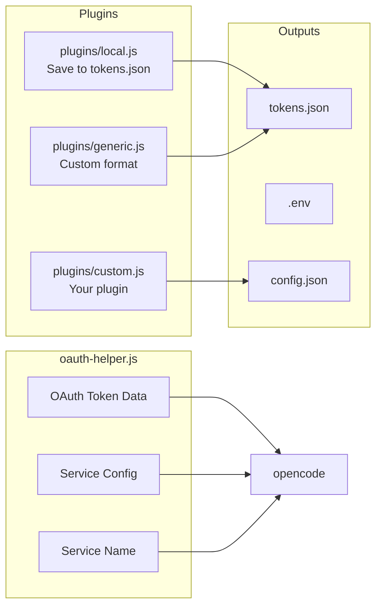

# OAuth MCP Setup

A generic OAuth helper that handles authentication for any MCP-compatible OAuth provider and runs a local MCP proxy server. This solution bypasses OAuth implementation bugs in various MCP clients by handling authentication completely locally and proxying requests with proper Authorization headers.

## Problem Statement

MCP clients (OpenCode, Claude Desktop, VS Code, Cursor) have inconsistent and often buggy OAuth implementations:

- **Different authentication flows** - Each client handles OAuth differently
- **Token management complexity** - Manual token refresh and storage required
- **Multi-service challenges** - Difficult to authenticate with multiple services
- **Location-dependent** - OAuth configs often tied to specific directories

These bugs cause authentication failures, token expiry issues, and poor developer experience.

## Solution

The OAuth Token Manager solves these problems by:

1. **Local OAuth flow** - Complete OAuth 2.0 with PKCE handled locally
2. **Generic proxy server** - Forwards requests to any OAuth-enabled MCP server
3. **Multi-service support** - Configure multiple OAuth providers in one place
4. **Auto token refresh** - Handles token expiry with automatic refresh
5. **Plugin system** - Extensible architecture for custom token storage
6. **Location-independent** - Works in any project directory

## Architecture

### Authentication Flow



### MCP Proxy Flow



### Multi-Service Architecture



### Plugin System Flow



## Key Features

- ✅ **Generic** - Works with any OAuth MCP server (NetSuite, Notion, Jira, GitHub, etc.)
- ✅ **Multi-Service** - Configure multiple OAuth providers in single config.yaml
- ✅ **Location-Independent** - Works in any project - just drop in and run
- ✅ **Simple Configuration** - Just YAML with environment variable support
- ✅ **Auto-Discovery** - Automatically discovers tools from all configured services
- ✅ **Token Refresh** - Automatic token refresh on 401/403 with single retry
- ✅ **Clear Tool Names** - Prefix-based naming (netsuite.ns_runSavedSearch, notion.searchPages)
- ✅ **Extensible Plugins** - Create custom token storage plugins
- ✅ **Universal** - Works with OpenCode, Claude Desktop, VS Code, Cursor, and more
- ✅ **Error Logging** - All errors logged to stderr for debugging

## Getting Started

### Prerequisites

- Node.js 18+ 
- npm or bun
- OAuth credentials for your service(s)

### Installation

```bash
git clone <repo-url>
cd oauth-mcp-setup
npm install
```

### Configuration

1. Copy the example configuration:
```bash
cp config.example.yaml config.yaml
```

2. Edit `config.yaml` with your OAuth credentials:

```yaml
services:
  netsuite:
    client_id: ${NETSUITE_CLIENT_ID}
    client_secret: ${NETSUITE_CLIENT_SECRET}
    redirect_uri: http://localhost:8080/callback
    scope: mcp
    auth_url: https://<account-id>.app.netsuite.com/app/login/oauth2/authorize.nl
    token_url: https://<account-id>.suitetalk.api.netsuite.com/services/rest/auth/oauth2/v1/token
    mcp_url: https://<account-id>.suitetalk.api.netsuite.com/services/mcp/v1/all

  notion:
    client_id: ${NOTION_CLIENT_ID}
    client_secret: ${NOTION_CLIENT_SECRET}
    redirect_uri: http://localhost:8080/callback
    scope: "read write"
    auth_url: https://api.notion.com/v1/oauth/authorize
    token_url: https://api.notion.com/v1/oauth/token
    mcp_url: https://mcp.notion.com/mcp
```

3. Set environment variables (recommended):
```bash
export NETSUITE_CLIENT_ID="your-client-id"
export NETSUITE_CLIENT_SECRET="your-client-secret"
export NOTION_CLIENT_ID="your-notion-id"
export NOTION_CLIENT_SECRET="your-notion-secret"
```

## Usage

### Generate OAuth Tokens

Generate tokens for each service you need:

```bash
# Generate NetSuite tokens
npm run auth netsuite

# Generate Notion tokens
npm run auth notion

# Generate Jira tokens
npm run auth jira
```

The browser will open for authentication. After successful login, tokens are saved to `tokens.json` in the current directory.

### Start MCP Proxy

```bash
npm run proxy
```

The proxy will:
- Load tokens from `tokens.json`
- Discover tools from all configured services
- Start MCP server on stdio
- Prefix tool names with service names

### Configure MCP Clients

**OpenCode** (`~/.config/opencode/opencode.json`):
```json
{
  "mcp": {
    "oauth-proxy": {
      "type": "local",
      "command": ["node", "/path/to/oauth-mcp-setup/mcp-proxy.js"]
    }
  }
}
```

**Claude Desktop** (`~/.claude/settings/mcp-settings.json`):
```json
{
  "oauth-proxy": {
    "command": "node",
    "args": ["/path/to/oauth-mcp-setup/mcp-proxy.js"]
  }
}
```

**VS Code** (`.vscode/mcp.json`):
```json
{
  "servers": {
    "oauth-proxy": {
      "type": "local",
      "command": "node",
      "args": ["/path/to/oauth-mcp-setup/mcp-proxy.js"]
    }
  }
}
```

**Cursor** (`.cursor/mcp.json`):
```json
{
  "oauth-proxy": {
    "type": "local",
    "command": "node",
    "args": ["/path/to/oauth-mcp-setup/mcp-proxy.js"]
  }
}
```

### Using Tools

Tools are automatically discovered with prefix-based naming:

- `netsuite.ns_runSavedSearch` - Run NetSuite saved search
- `netsuite.ns_getRecord` - Get NetSuite record
- `notion.searchPages` - Search Notion pages
- `notion.getPage` - Get Notion page
- `jira.getIssue` - Get Jira issue
- `github.getFile` - Get GitHub file

**Example usage in conversation:**
```
"Search for customers using the netsuite.ns_runSavedSearch tool"
"Create a new page in Notion with the notion.createPage tool"
```

## Plugin System

### What is a Plugin?

Plugins process OAuth token data after successful authentication and store it in your preferred format or location. This makes the system extensible for different workflows and integrations.

### Plugin Interface

All plugins must export a default async function with this signature:

```javascript
export default async function(tokenData, config, serviceName) {
  // Your implementation
}
```

**Parameters:**

- `tokenData` (Object) - OAuth token response from provider
  - `access_token`: Access token string
  - `refresh_token`: Refresh token (optional)
  - `expires_in`: Expiration time in seconds
  - `scope`: Granted OAuth scope(s)
  - Additional provider-specific fields

- `config` (Object) - Service configuration from config.yaml
  - `client_id`, `client_secret`: OAuth credentials
  - `redirect_uri`, `scope`: OAuth parameters
  - `auth_url`, `token_url`, `mcp_url`: Service endpoints

- `serviceName` (String) - Service name (e.g., 'netsuite', 'notion')

### Creating a Custom Plugin

Create a plugin that saves tokens to your preferred format:

```javascript
import fs from 'fs';
import path from 'path';

export default async function(tokenData, config, serviceName) {
  const expiresAt = Date.now() / 1000 + parseInt(tokenData.expires_in || 3600);
  
  const customFormat = {
    service: serviceName,
    accessToken: tokenData.access_token,
    refreshToken: tokenData.refresh_token,
    expiresAt: expiresAt,
    serverUrl: config.mcp_url,
    timestamp: new Date().toISOString()
  };
  
  const outputPath = path.join(process.cwd(), 'my-tokens.json');
  fs.writeFileSync(outputPath, JSON.stringify(customFormat, null, 2));
  
  console.log(`✅ Custom plugin saved tokens for ${serviceName}`);
}
```

### Register Your Plugin

Add your plugin to `config.yaml`:

```yaml
services:
  my-service:
    client_id: ${MY_CLIENT_ID}
    client_secret: ${MY_CLIENT_SECRET}
    # ... other config ...
    plugin: ./plugins/my-plugin.js
```

**Note:** If no `plugin` is specified, the system defaults to `./plugins/local.js`.

### Built-in Plugins

**`plugins/local.js`** (Default - Recommended for mcp-proxy)
- Saves to `tokens.json` in current directory
- Multi-service support with service name as key
- Includes all OAuth metadata for token refresh
- Used by default if no plugin specified in config.yaml

**`plugins/generic.js`**
- Simple JSON export
- Saves to `tokens.json`
- Minimal structure

## Configuration

### Full Configuration Structure

```yaml
services:
  netsuite:
    client_id: ${NETSUITE_CLIENT_ID}
    client_secret: ${NETSUITE_CLIENT_SECRET}
    
    # OAuth configuration
    redirect_uri: http://localhost:8080/callback
    scope: mcp
    auth_url: https://<account-id>.app.netsuite.com/app/login/oauth2/authorize.nl
    token_url: https://<account-id>.suitetalk.api.netsuite.com/services/rest/auth/oauth2/v1/token
    
    # MCP server URL
    mcp_url: https://<account-id>.suitetalk.api.netsuite.com/services/mcp/v1/all
    
    # Token storage plugin (optional, defaults to ./plugins/local.js)
    # plugin: ./plugins/local.js

  notion:
    client_id: ${NOTION_CLIENT_ID}
    client_secret: ${NOTION_CLIENT_SECRET}
    redirect_uri: http://localhost:8080/callback
    scope: "read write"
    auth_url: https://api.notion.com/v1/oauth/authorize
    token_url: https://api.notion.com/v1/oauth/token
    mcp_url: https://mcp.notion.com/mcp

  jira:
    client_id: ${JIRA_CLIENT_ID}
    client_secret: ${JIRA_CLIENT_SECRET}
    redirect_uri: http://localhost:8080/callback
    scope: "read:jira-work"
    auth_url: https://auth.atlassian.com/authorize
    token_url: https://auth.atlassian.com/oauth/token
    mcp_url: https://your-domain.atlassian.net/mcp

  github:
    client_id: ${GITHUB_CLIENT_ID}
    client_secret: ${GITHUB_CLIENT_SECRET}
    redirect_uri: http://localhost:8080/callback
    scope: "repo read:user"
    auth_url: https://github.com/login/oauth/authorize
    token_url: https://github.com/login/oauth/access_token
    mcp_url: https://api.github.com/mcp
```

### Token File Format

`tokens.json` stores tokens for all services:

```json
{
  "netsuite": {
    "accessToken": "eyJh...",
    "refreshToken": "eyJh...",
    "serverUrl": "https://account-id.suitetalk.api.netsuite.com/services/mcp/v1/all",
    "tokenUrl": "https://account-id.suitetalk.api.netsuite.com/services/rest/auth/oauth2/v1/token",
    "clientId": "your-client-id",
    "clientSecret": "your-client-secret",
    "expiresAt": 1770410670.68,
    "scope": "mcp"
  },
  "notion": {
    "accessToken": "secret_...",
    "refreshToken": "secret_...",
    "serverUrl": "https://mcp.notion.com/mcp",
    "tokenUrl": "https://api.notion.com/v1/oauth/token",
    "clientId": "your-notion-id",
    "clientSecret": "your-notion-secret",
    "expiresAt": 1770500000,
    "scope": "read write"
  }
}
```

## Troubleshooting

### "No tokens.json found"

**Cause:** Tokens not generated yet.

**Solution:**
```bash
npm run auth <service-name>
```

### "Service <name> not configured"

**Cause:** Service not in tokens.json or config.yaml.

**Solution:**
```bash
# Generate tokens for missing service
npm run auth <service-name>

# Or verify service name in config.yaml
cat config.yaml | grep -A 1 "services:"
```

### "Cannot refresh <service>: missing tokenUrl"

**Cause:** Token refresh URL not saved in tokens.json.

**Solution:**
- Check config.yaml has `token_url` for service
- Regenerate tokens: `npm run auth <service-name>`

### Tools not appearing in MCP client

**Causes:** Multiple possible issues.

**Solutions:**
1. Check logs: Run proxy in terminal to see stderr output
2. Verify tokens.json exists and is valid JSON: `cat tokens.json`
3. Verify proxy is running: `npm run proxy`
4. Check MCP client configuration path is correct
5. Restart MCP client after configuration changes

### "HTTP 401 from <service>: invalid_token"

**Cause:** Token completely invalid (not just expired).

**Solution:**
```bash
# Re-authenticate
npm run auth <service-name>
```

### Token refresh fails repeatedly

**Cause:** Client secret changed or refresh token revoked.

**Solution:**
```bash
# Re-authenticate to get new refresh token
npm run auth <service-name>
```

### "Invalid tool name: <tool>"

**Cause:** Tool name doesn't match `<service>.<tool>` format.

**Solution:**
- Verify tool name has prefix (e.g., `netsuite.ns_runSavedSearch`)
- Check available tools by listing them in your MCP client

## Security

⚠️ **Never commit sensitive files**

Files to exclude from version control:
- `config.yaml` - Contains client secrets
- `tokens.json` - Contains access and refresh tokens

These files are already in `.gitignore`:
```
config.yaml
tokens.json
```

### Best Practices

1. **Use environment variables** for credentials:
```yaml
client_id: ${CLIENT_ID}
client_secret: ${CLIENT_SECRET}
```

2. **Limit token scope** to minimum required permissions

3. **Rotate client secrets** regularly

4. **Store tokens securely** - Current approach uses plaintext JSON. For production:
   - Encrypt tokens.json with user-specific key
   - Use system keychain (macOS Keychain, Windows Credential Manager)
   - Restrict file permissions (chmod 600)

5. **Never log or print tokens** in production code

6. **Monitor token usage** for unusual patterns

## License

MIT

## Contributing

Contributions are welcome! Areas for improvement:

- Additional plugins for popular MCP clients
- Token encryption support
- Token health check functionality
- Plugin system enhancements
- Documentation improvements
