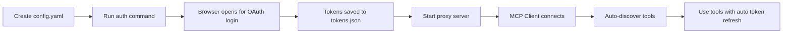

# OAuth MCP Proxy

**A generic OAuth proxy server that bypasses buggy OAuth implementations in MCP clients by handling authentication completely locally.**

> Stop wrestling with inconsistent OAuth flows across OpenCode, Claude Desktop, VS Code, and Cursor. This proxy handles everything locally and forwards authenticated requests to any OAuth-enabled MCP server.

## 🔴 The Problem

MCP clients have broken OAuth implementations:

| Client | Issue |
|--------|-------|
| OpenCode | OAuth flow intermittently fails, tokens not persisted |
| Claude Desktop | Requires manual token refresh, poor error handling |
| VS Code | Token storage tied to workspace, refreshes silently fail |
| Cursor | Multi-service authentication is a nightmare |

**Result:** Authentication failures, expired tokens, and lost productivity debugging OAuth instead of building features.

## ✅ The Solution

OAuth MCP Proxy handles authentication independently of your MCP client:

1. **Local OAuth 2.0 with PKCE** - Complete auth flow managed locally
2. **Generic MCP Proxy** - Forwards requests to any OAuth-enabled service
3. **Multi-Service Support** - NetSuite, Notion, Jira, GitHub, all in one place
4. **Automatic Token Refresh** - Tokens refreshed on 401/403 with single retry
5. **Client-Agnostic** - Works with any MCP client (OpenCode, Claude Desktop, VS Code, Cursor)
6. **Auto Discovery** - Automatically discovers tools from all configured services
7. **Prefix Naming** - Clear tool names like `netsuite.ns_runSavedSearch`, `notion.searchPages`
8. **Location-Independent** - Works in any project directory
9. **Simple Config** - Just YAML with environment variable support
10. **Extensible** - Plugin system for custom token storage

## 🚀 Quick Start

### Option 1: Using npx (Recommended)

No installation needed:

```bash
# 1. Create config.yaml
cat > config.yaml << 'EOF'
services:
  netsuite:
    client_id: ${NETSUITE_CLIENT_ID}
    client_secret: ${NETSUITE_CLIENT_SECRET}
    redirect_uri: http://localhost:8080/callback
    scope: mcp
    auth_url: https://<account-id>.app.netsuite.com/app/login/oauth2/authorize.nl
    token_url: https://<account-id>.suitetalk.api.netsuite.com/services/rest/auth/oauth2/v1/token
    mcp_url: https://<account-id>.suitetalk.api.netsuite.com/services/mcp/v1/all
EOF

# 2. Generate OAuth tokens
npx oauth-mcp-proxy auth netsuite --config ./config.yaml

This will open a browser page where you can authenticate and authorize the application.

# 3. Start the proxy
npx oauth-mcp-proxy proxy --config ./config.yaml
```

### Option 2: Local Installation

Clone and run locally:

```bash
# 1. Clone the repository
git clone <repo-url>
cd oauth-mcp-proxy
bun install

# 2. Create config.yaml
cp config.example.yaml config.yaml
# Edit config.yaml with your credentials

# 3. Generate OAuth tokens
bun run auth netsuite

# 4. Start the proxy
bun run proxy
```

### Option 2: Local Installation

Clone and run locally:

```bash
# 1. Clone the repository
git clone <repo-url>
cd oauth-mcp-setup
npm install

# 2. Create config.yaml
cp config.example.yaml config.yaml
# Edit config.yaml with your credentials

# 3. Generate OAuth tokens
npm run auth netsuite

# 4. Start the proxy
npm run proxy
```

### Option 3: Direct mcp-proxy.js Import

Import the proxy directly into your project:

```javascript
// In your MCP client config
{
  "mcp": {
    "netsuite-proxy": {
      "type": "local",
      "command": ["node", "/path/to/oauth-mcp-setup/mcp-proxy.js"],
      "args": ["--config", "/path/to/your/config.yaml"]
    }
  }
}
```

## 📋 Configuration

Create a `config.yaml` with your OAuth credentials:

```yaml
services:
  netsuite:
    client_id: ${NETSUITE_CLIENT_ID}
    client_secret: ${NETSUITE_CLIENT_SECRET}
    redirect_uri: http://localhost:8080/callback
    scope: mcp
    auth_url: https://<account-id>.app.netsuite.com/app/login/oauth2/authorize.nl
    token_url: https://<account-id>.suitetalk.api.netsuite.com/services/rest/auth/oauth2/v1/token
    mcp_url: https://<account-id>.suitetalk.api.netsuite.com/services/mcp/v1/all

  notion:
    client_id: ${NOTION_CLIENT_ID}
    client_secret: ${NOTION_CLIENT_SECRET}
    redirect_uri: http://localhost:8080/callback
    scope: "read write"
    auth_url: https://api.notion.com/v1/oauth/authorize
    token_url: https://api.notion.com/v1/oauth/token
    mcp_url: https://mcp.notion.com/mcp
```

**Set environment variables:**
```bash
export NETSUITE_CLIENT_ID="your-client-id"
export NETSUITE_CLIENT_SECRET="your-client-secret"
export NOTION_CLIENT_ID="your-notion-id"
export NOTION_CLIENT_SECRET="your-notion-secret"
```

## 🔌 MCP Client Configuration

### OpenCode (`~/.config/opencode/opencode.json`)

```json
{
  "mcp": {
    "oauth-proxy": {
      "type": "local",
      "command": "npx",
      "args": ["oauth-mcp-proxy", "proxy", "--config", "/path/to/config.yaml"]
    }
  }
}
```

### Claude Desktop (`~/.claude/settings/mcp-settings.json`)

```json
{
  "oauth-proxy": {
    "command": "npx",
  "args": ["oauth-mcp-proxy", "proxy", "--config", "/path/to/config.yaml"]
  }
}
```

### VS Code (`.vscode/mcp.json`)

```json
{
  "servers": {
    "oauth-proxy": {
      "type": "local",
      "command": "npx",
      "args": ["oauth-mcp-proxy", "proxy", "--config", "/path/to/config.yaml"]
    }
  }
}
```

### Cursor (`.cursor/mcp.json`)

```json
{
  "oauth-proxy": {
    "type": "local",
    "command": "npx",
    "args": ["oauth-mcp-proxy", "proxy", "--config", "/path/to/config.yaml"]
  }
}
```

## 📝 Commit Message Format

This project uses [Conventional Commits](https://www.conventionalcommits.org/) format for automated versioning and changelog generation.

**Format:**
```
<type>(<scope>): <subject>

<body>

<footer>
```

**Types:**
- `feat:` - New feature (triggers minor version bump)
- `fix:` - Bug fix (triggers patch version bump)
- `BREAKING CHANGE:` - Breaking changes (triggers major version bump)
- `chore:`, `docs:`, `style:`, `refactor:`, `test:` - No version bump

**Examples:**
```
feat(auth): add PKCE flow support
fix(proxy): handle 401 errors with auto token refresh
chore(deps): upgrade dependencies
```

## 🚀 Release Process

Releases are automated using [semantic-release](https://github.com/semantic-release/semantic-release):

1. Commit changes with conventional commit format
2. Push to main branch
3. Manually trigger release workflow (optional dry-run available)
4. semantic-release analyzes commits, bumps version, creates tag, generates changelog, publishes to npm and GitHub

**Manual trigger:** Go to Actions → Release → Run workflow → Set `dry_run` to `false` to release, or `true` to preview

**Version bumping is automatic:**
- Each `feat:` commit → minor version bump
- Each `fix:` commit → patch version bump
- Each `BREAKING CHANGE:` → major version bump
- Other commit types → no release triggered

## 🏗️ Architecture

### User Flow



## 📖 Usage Examples

### Available Tools

Tools are automatically discovered with service prefixes:

- `netsuite.ns_runSavedSearch` - Run NetSuite saved search
- `netsuite.ns_getRecord` - Get NetSuite record
- `notion.searchPages` - Search Notion pages
- `notion.getPage` - Get Notion page
- `jira.getIssue` - Get Jira issue
- `github.getFile` - Get GitHub file

### Example Usage in Conversation

```
User: "Search for customers using the netsuite.ns_runSavedSearch tool"
User: "Create a new page in Notion with the notion.createPage tool"
User: "Get issue JIRA-123 using jira.getIssue"
```

## 🔧 Advanced: Plugin System

### What are Plugins?

Plugins process OAuth token data after authentication and store it in your preferred format.

### Plugin Interface

```javascript
export default async function(tokenData, config, serviceName, tokensPath) {
  // Your implementation
}
```

**Parameters:**
- `tokenData` - OAuth token response (access_token, refresh_token, expires_in, scope)
- `config` - Service configuration from config.yaml
- `serviceName` - Service name ('netsuite', 'notion', etc.)
- `tokensPath` - Path to tokens.json

### Built-in Plugins

**`plugins/local.js`** (Default)
- Saves to `tokens.json` in current directory
- Multi-service support with service name as key
- Includes all OAuth metadata for token refresh

**`plugins/generic.js`**
- Simple JSON export
- Saves to `tokens.json`

### Creating a Custom Plugin

```javascript
import fs from 'fs';
import path from 'path';

export default async function(tokenData, config, serviceName, tokensPath) {
  const expiresAt = Date.now() / 1000 + parseInt(tokenData.expires_in || 3600);
  
  const customFormat = {
    service: serviceName,
    accessToken: tokenData.access_token,
    refreshToken: tokenData.refresh_token,
    expiresAt: expiresAt,
    serverUrl: config.mcp_url,
    timestamp: new Date().toISOString()
  };
  
  const outputPath = path.join(process.cwd(), 'my-tokens.json');
  fs.writeFileSync(outputPath, JSON.stringify(customFormat, null, 2));
  
  console.log(`✅ Custom plugin saved tokens for ${serviceName}`);
}
```

Register in `config.yaml`:
```yaml
services:
  my-service:
    client_id: ${MY_CLIENT_ID}
    client_secret: ${MY_CLIENT_SECRET}
    # ... other config ...
    plugin: ./plugins/my-plugin.js
```

## 🐛 Troubleshooting

### "No tokens.json found"
```bash
# Generate tokens
npx oauth-mcp-proxy auth <service-name>
```

### "Service <name> not configured"
```bash
# Verify service in config.yaml
cat config.yaml | grep -A 1 "services:"

# Generate missing tokens
npx oauth-mcp-proxy auth <service-name>
```

### Tools not appearing in MCP client

1. Check logs: Run proxy in terminal to see stderr output
2. Verify tokens.json exists and is valid JSON: `cat tokens.json`
3. Verify proxy is running
4. Check MCP client configuration path
5. Restart MCP client after changes

### "HTTP 401: invalid_token"

Tokens are completely invalid:
```bash
# Re-authenticate
npx oauth-mcp-proxy auth <service-name>
```

### Token refresh fails repeatedly

Refresh token revoked or client secret changed:
```bash
# Re-authenticate to get new refresh token
npx oauth-mcp-proxy auth <service-name>
```

## 📄 Token File Format

`tokens.json` stores tokens for all services:

```json
{
  "netsuite": {
    "accessToken": "eyJh...",
    "refreshToken": "eyJh...",
    "serverUrl": "https://account-id.suitetalk.api.netsuite.com/services/mcp/v1/all",
    "tokenUrl": "https://account-id.suitetalk.api.netsuite.com/services/rest/auth/oauth2/v1/token",
    "clientId": "your-client-id",
    "clientSecret": "your-client-secret",
    "expiresAt": 1770410670.68,
    "scope": "mcp"
  },
  "notion": {
    "accessToken": "secret_...",
    "refreshToken": "secret_...",
    "serverUrl": "https://mcp.notion.com/mcp",
    "tokenUrl": "https://api.notion.com/v1/oauth/token",
    "clientId": "your-notion-id",
    "clientSecret": "your-notion-secret",
    "expiresAt": 1770500000,
    "scope": "read write"
  }
}
```

## 📝 License

MIT

## 🤝 Contributing

Contributions welcome!
